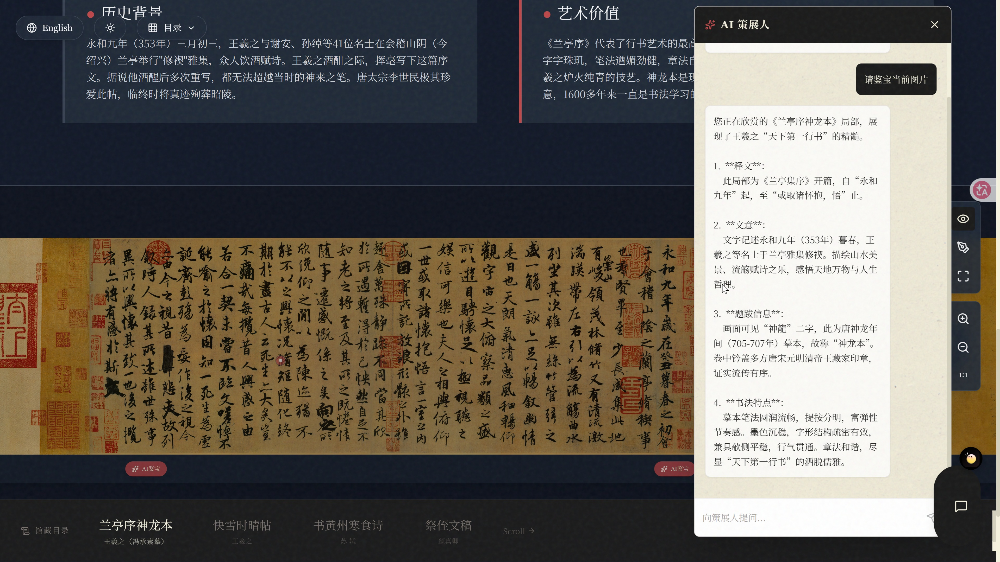
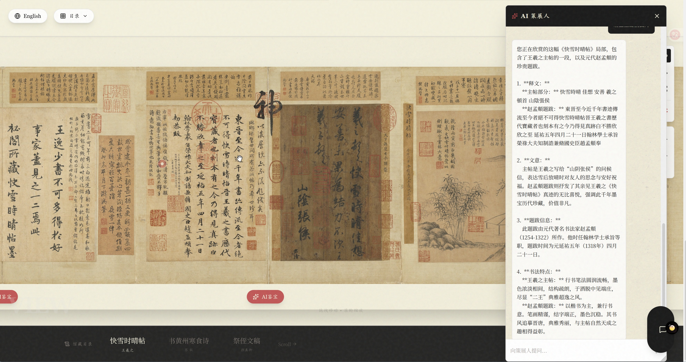
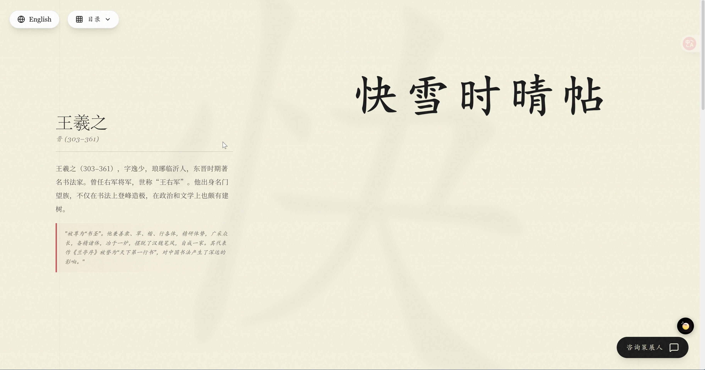
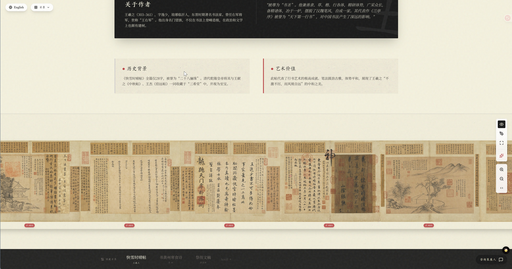
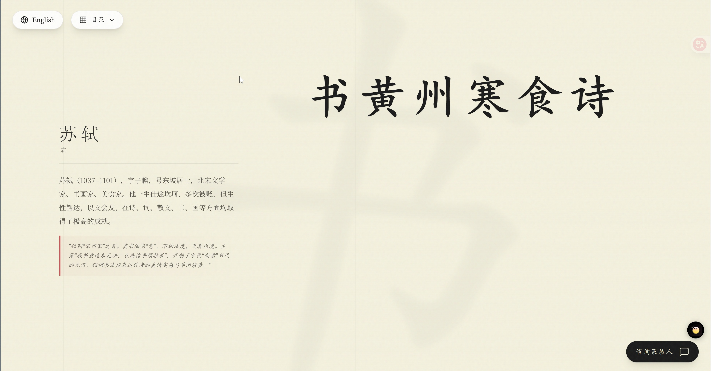
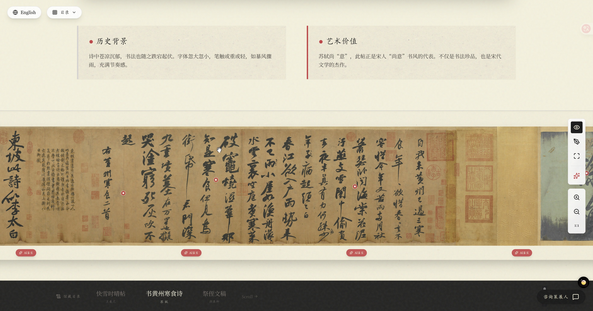
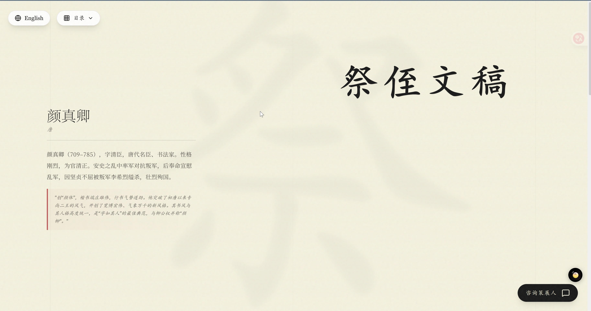
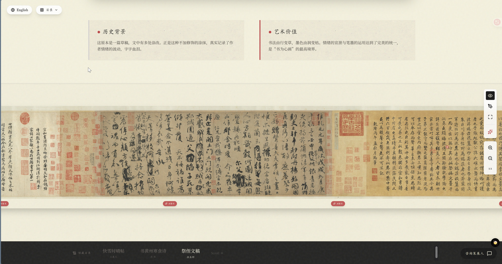

# 墨雪：数字书法博物馆 / Ink & Snow: Digital Calligraphy Museum

<div align="center">

[](https://react.dev/)
[](https://www.typescriptlang.org/)
[](https://vitejs.dev/)
[](https://ai.google.dev/)
[](https://www.docker.com/)
[](LICENSE)

</div>

一个沉浸式的中国书法数字博物馆，结合 AI 技术提供智能鉴赏和策展人对话功能。

An immersive digital museum for Chinese calligraphy, featuring AI-powered appraisal and curator chat capabilities.

## 📸 项目截图 / Screenshots
<div align="center">
  
  <p><em>AI 鉴宝 - 智能识别和分析书法内容</em></p>
</div>
<div align="center">
  
  <p><em>AI 鉴宝 - 智能识别和分析书法内容</em></p>
</div>

<div align="center">
  
  <p><em>作者介绍</em></p>
</div>

<div align="center">
  
  <p><em>深度缩放浏览 - 高清书法作品无损缩放 微观赏析 - 放大观察笔墨纹理细节</em></p>
</div>

<div align="center">
  
  <p><em>AI 作者介绍</em></p>
</div>

<div align="center">
  
  <p><em>深度缩放浏览 - 高清书法作品无损缩放 微观赏析 - 放大观察笔墨纹理细节</em></p>
</div>

<div align="center">
  
  <p><em>作者介绍</em></p>
</div>

<div align="center">
  
  <p><em>深度缩放浏览 - 高清书法作品无损缩放 微观赏析 - 放大观察笔墨纹理细节</em></p>
</div>

## ✨ 主要功能 / Features

- 🖼️ **深度缩放浏览** - 高清书法作品的无损缩放和平移
- 🎨 **临摹模式** - 在书法作品上进行数字临摹
- 🔍 **微观赏析** - 放大观察笔墨纹理细节
- 🤖 **AI 鉴宝** - 智能识别和分析书法作品的局部内容
- 💬 **AI 策展人** - 与 AI 策展人对话，深入了解作品背景和艺术特色
- 🌐 **双语支持** - 中文/英文界面切换

## 🚀 快速开始 / Quick Start

### 前置要求 / Prerequisites

- Node.js (v16+)
- npm 或 yarn

### 安装步骤 / Installation

1. **克隆项目 / Clone the repository**
   ```bash
   git clone <repository-url>
   cd calligraphy
   ```

2. **安装依赖 / Install dependencies**
   ```bash
   npm install
   ```

3. **配置环境变量 / Configure environment**
   
   复制 `.env.example` 为 `.env` 并配置：
   ```bash
   cp .env.example .env
   ```
   
   编辑 `.env` 文件：
   ```env
   # API 配置
   # 支持多个 API Key，用逗号分隔，系统会自动轮询使用
   # 例如: API_KEY=key1,key2,key3
   API_KEY=your_api_key_1,your_api_key_2,your_api_key_3
   API_URL=https://generativelanguage.googleapis.com
   MODEL=gemini-2.5-flash
   
   # ⚠️ 重要：模型必须支持视觉功能（Vision）
   # 推荐使用支持视觉的模型：
   # - gemini-2.5-flash (推荐)
   ```

4. **启动服务 / Start the application**
   ```bash
   npm start
   ```
   
   这将同时启动：
   - 前端开发服务器：http://localhost:33000
   - 后端 API 服务器：http://localhost:33001

## 🔑 API Key 配置说明

### 多 Key 轮询机制

系统支持配置多个 Gemini API Key，通过逗号分隔：

```env
API_KEY=key1,key2,key3,key4
```

**特性：**
- ✅ 自动轮询使用多个 API Key
- ✅ 智能跳过失败的 Key
- ✅ 失败的 Key 在 5 分钟后自动恢复重试
- ✅ 所有 Key 失败时显示友好提示

### 模型要求

⚠️ **重要：AI 鉴宝功能需要使用支持视觉（Vision）的模型**

**推荐模型：**
- `gemini-2.0-flash` ✅ (推荐，最新)

### 获取 API Key

访问 [Google AI Studio](https://aistudio.google.com/app/apikey) 获取免费的 Gemini API Key。

**注意事项：**
1. 确保选择支持视觉功能的模型
2. 免费配额可能有限制，建议配置多个 Key
3. 定期检查 API 使用情况

## 📦 Docker 部署 / Docker Deployment

### 使用 Docker Compose

1. **配置环境变量**
   ```bash
   cp .env.example .env
   # 编辑 .env 文件，填入你的 API Keys
   ```

2. **启动容器**
   
   Windows:
   ```bash
   docker-start.bat
   ```
   
   Linux/Mac:
   ```bash
   chmod +x docker-start.sh
   ./docker-start.sh
   ```

3. **访问应用**
   
   打开浏览器访问：http://localhost:48888

### 手动 Docker 命令

```bash
# 构建镜像
docker build -t calligraphy-museum .

# 运行容器
docker run -p 48888:80 --env-file .env calligraphy-museum
```

## 🛠️ 技术栈 / Tech Stack

- **前端 / Frontend**
  - React 19
  - TypeScript
  - Vite
  - Tailwind CSS
  - Lucide Icons

- **后端 / Backend**
  - Node.js
  - Express
  - Google Gemini API
  - Sharp (图片压缩)

- **部署 / Deployment**
  - Docker
  - Nginx

## 📁 项目结构 / Project Structure

```
calligraphy/
├── components/          # React 组件
│   ├── AIAppraisalButton.tsx
│   ├── CuratorChat.tsx
│   ├── DeepZoomViewer.tsx
│   └── TracingCanvas.tsx
├── services/           # API 服务
│   └── geminiService.ts
├── server/             # 后端服务器
│   └── index.js
├── assets/             # 静态资源（书法作品图片）
├── App.tsx             # 主应用组件
├── index.tsx           # 应用入口
├── metadata.json       # 作品元数据
├── .env.example        # 环境变量示例
├── docker-compose.yml  # Docker Compose 配置
├── Dockerfile          # Docker 镜像配置
└── README.md           # 项目文档
```

## 🎨 使用说明 / Usage Guide

### 浏览模式
- **拖拽移动**：点击并拖动画布
- **滚轮缩放**：使用鼠标滚轮放大/缩小
- **热点标记**：点击红色标记查看详细说明

### AI 鉴宝
1. 点击图片下方的 "AI鉴宝" 按钮
2. AI 会自动分析当前图片的内容
3. 查看释文、文意、题跋信息和书法特点

### AI 策展人对话
1. 点击右下角的 "咨询策展人" 按钮
2. 在对话框中输入问题
3. 可拖动对话框移动位置
4. 可拖动右下角调整对话框大小

### 临摹模式
1. 点击工具栏的笔刷图标
2. 在书法作品上进行数字临摹
3. 使用不同的笔刷和颜色

## 🔧 开发命令 / Development Commands

```bash
# 安装依赖
npm install

# 启动开发服务器（前端+后端）
npm start

# 仅启动前端
npm run dev

# 仅启动后端
npm run server

# 构建生产版本
npm run build

# 预览生产版本
npm run preview
```

## 🐛 故障排除 / Troubleshooting

### API Key 错误
- 确保 `.env` 文件中的 API_KEY 配置正确
- 检查 API Key 是否有效且未过期
- 确认 API_URL 配置正确
- ⚠️ **确保使用支持视觉功能的模型**（如 gemini-2.0-flash-exp）

### 图片加载失败
- 检查 `assets/` 目录中的图片文件是否存在
- 确认 `metadata.json` 中的图片路径正确

### 网络连接错误
- 如果遇到 "Client network socket disconnected" 错误：
  1. 检查网络代理设置
  2. 确保防火墙允许访问 generativelanguage.googleapis.com
  3. 在中国大陆可能需要配置代理或使用 VPN
  4. 检查系统时间是否正确
  5. 尝试重启网络或更换网络环境

### 端口冲突
- 前端默认端口：33000
- 后端默认端口：33001
- Docker 对外端口：48888
- 如需修改，请编辑相应的配置文件

## 📄 许可证 / License

本项目采用 MIT License 开源。详见 [LICENSE](LICENSE) 文件。

This project is licensed under the MIT License. See [LICENSE](LICENSE) file for details.

### ⚠️ 重要版权声明

**书法作品图片来自國立故宮博物院（台北故宫博物院），著作权归故宫博物院所有。**

**本项目仅供教育、学习和研究目的使用，不得用于商业用途。**

The calligraphy artwork images are from the National Palace Museum, Taipei. Copyright © National Palace Museum.

This project is for educational, learning, and research purposes only. Commercial use is prohibited.

如需商业使用，请联系國立故宮博物院获取授权：https://www.npm.gov.tw/

For commercial use, please contact the National Palace Museum for authorization: https://www.npm.gov.tw/

详细版权信息请查看 [COPYRIGHT.md](COPYRIGHT.md)。

For detailed copyright information, see [COPYRIGHT.md](COPYRIGHT.md).

## 🤝 贡献 / Contributing

欢迎提交 Issue 和 Pull Request！

Welcome to submit Issues and Pull Requests!

## 📧 联系方式 / Contact

如有问题或建议，请通过 Issue 联系我们。

For questions or suggestions, please contact us through Issues.

---

Made with ❤️ for Chinese Calligraphy Art
